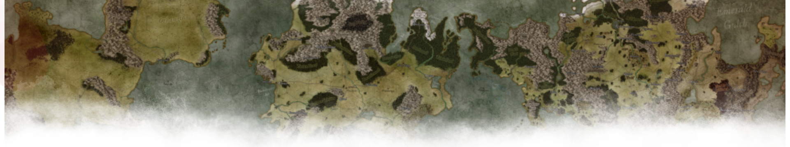

    
    <h1>Atlas Exandria</h1>
    <h4>Design Document</h4>
     
    by <strong>Donald Farland</strong>
     
    <a href="https://donfarland.com">donfarland.com</a> - <a href="https://raphus.social/@MrFarland">@MrFarland</a>
     
     

    <a href="#introduction">Introduction</a> •
    <a href="#goals">Goals</a> •
    <a href="#requirements">Requirements</a> •
    <a href="#credits">Credits</a> •
    <a href="#legal">Legal</a>

## Introduction
Atlas Exandria is a comprehensive geographical reference for the world of Exandria for 5th edition [Dungeons & Dragons](https://dnd.wizards.com) game masters running "open world" campaigns & adventures in the [Critical Role](https://critrole.com) universe. Atlas Exandria is an interactive reference module for the [EncounterPlus](https://encounter.plus) virtual tabletop system available for Apple iOS and MacOS devices. 

### What is EncounterPlus?
[EncounterPlus](https://encounter.plus) is an advanced Virtual Tabletop (VTT) application for the 5th edition of the popular tabletop RPG system Dungeons & Dragons. It was designed to help Dungeon masters run combat encounters more easily, track initiative, health, statistics and conditions seamlessly and efficiently. It is available for iOS and Mac devices.

### What is an EncounterPlus Module?
A module is a collection of pages, encounters, and maps that can be quickly and easily imported into EncounterPlus. They can be reference materials, adventures, or any number of tools that can help run a D&D session more efficiently. 

This module was conceived, designed, and developed for the purpose of supporting my personal campaigns & adventures in the world of Exandria. As such, this module was created for:

- **[EncounterPlus](https://encounter.plus)**: Atlas Exandria is, first & foremost, a module for the EncounterPlus virtual tabletop system available for Apple iOS & MacOS devices. There will be an offline PDF version of this atlas, but it will lack many of the capabilities it was created for.
- **[Dungeons & Dragons](https://dnd.wizards.com) (5th Edition)**: While you may be able to use this module for your Pathfinder or other preferred tabletop role-playing game system, the module was created specifically for DnD5e.
- **Game Masters**: The Atlas Exandria was created for game masters running campaigns & adventures in Exandria. It is not a reference for the [stream](https://critrole.com) or "[The Legend of Vox Machina](https://www.imdb.com/title/tt11247158/)". The goal is "canon consistency", not 100% canon.

## Goals
The following are the goals of this project.

1. **Maps (Wonderdraft)**: Source files for the world, continent, & region maps.
1. **Maps (Image)**: Digital images of each map 
1. **Module**: Interactive atlas module for the EncounterPlus virtual tabletop.
1. **Offline Atlas**: An offline, non-interactive version of the atlas in PDF format.
1. **Cartographer's Guide**: Documentation on conventions used to create the maps.

## Requirements
This section contains the various requirements written in "user story" form to convey the specific needs & rationale for different types of users.

*As a **USER**, I want **NEED**, so that I can **RATIONALE***

### Cartography Guide
As a **Wonderdraft user**,

1. **Colors**: I want to know the hexadecimal color codes in the color palette, so that I can create a matching pallete in my copy of Wonderdraft.
1. **Conventions**: I want to know what map-making conventions were used to govern how and where items were placed, so that I can use the same conventions in my own maps.
1. **Labels**: I want to know what fonts and sizes were used for the various labels, so that I can create the same label formats in my copy of Wonderdraft.
1. **Resolution**: I want to know that the resolutions and dimensions are for the various map types, so that I can create maps of a similar size & scale.
1. **Settings**: I want to know what settings were used in Wonderdraft, so that I can configure my copy of Wonderdraft to produce maps with a similar style.
1. **Techniques**: I want to know what techniques were used to create the maps so that I can replicate the same look and feel as the originals.

### Digital Maps
As a **GM**,

1. 

### EncounterPlus Module
As an **EncounterPlus user**,

1. **Fluid (Pt. 1)**: I want the user interface & content to scale to different window sizes gracefully, so that I can launch the module from the module browser, shortcut bar, or search.
1. **Fluid (Pt. 2)**: I want the user interface & content to scale to different window sizes gracefully, so that I can use the module on my iPad or Mac.

### PDF Document
As a **GM**,

1. 

### Wonderdraft Maps
As a **Wonderdaft user**,

1. **Source Files**: I want access to the original Wonderdraft source files, so that I make my own modifications to suit my own version of Exandria.
1. **Stock Assets**: I want the maps to be created using only stock assets, so that I don't have to track down & install custom or commercial assets.

## Credits
I'd like to extend my special thanks to the entire EncounterPlus community. Their hard work, patience, advice, and encouragement have been huge. Thank you [Juraj](https://twitter.com/encounterplus) for such an amazing product; and thank you [JacobJ](https://raphus.social/@jacob) and [rrgeorge](https://raphus.social/@rrgeorge) for all your help. I couldn't have done this without you.

I have made a valiant effort to use my own words and resources in the creation of this module and use content released under Creative Commons licenses. If I have somehow inadvertently used your work and/or not given you appropriate credit, I apologize. Please contact me via [Mastodon](https://raphus.social/@MrFarland), [Twitter](https://twitter.com/MrFarland) or [Reddit](https://www.reddit.com/user/MrFarland) and I will rectify the situation as soon as humanly possible.

## Legal
**Atlas Exandria** by [Donald Farland](https://donfarland.com) is licensed under the [Creative Commons Attribution-NonCommercial-ShareAlike 4.0 International license](https://creativecommons.org/licenses/by-nc-sa/4.0/).

### Critical Role Content Policy
**Atlas Exandria** is unofficial fan content permitted under the [Critical Role Content Policy](https://critrole.com/critical-role-content-policy/). This module is NOT approved/endorsed by Critical Role.

### Wizards of the Coast Fan Content Policy
**Atlas Exandria** is unofficial Fan Content permitted under the [Wizards of the Coast Fan Content Policy](https://company.wizards.com/fancontentpolicy). Not approved/endorsed by Wizards. Portions of the materials used are property of Wizards of the Coast. ©Wizards of the Coast LLC. Wizards of the Coast, Dungeons & Dragons, and their logos are trademarks of Wizards of the Coast LLC in the United States and other countries. © 2015 Wizards. All Rights Reserved.