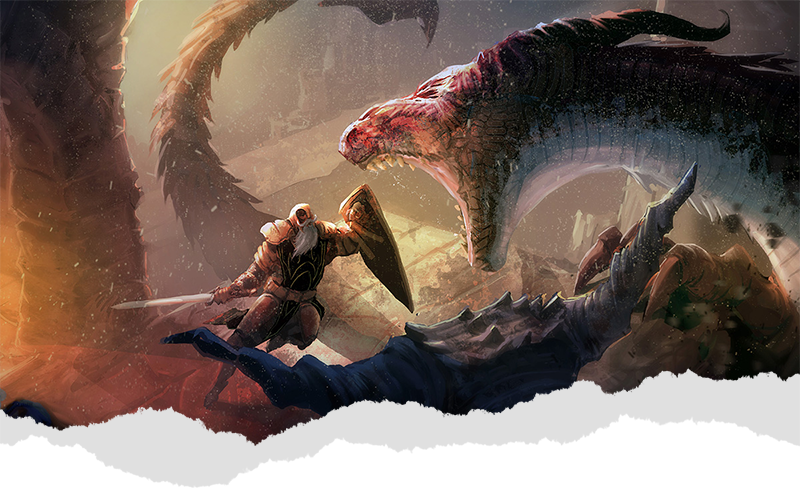

{.size-cover}
# Atlas Exandria {.text-center}
## Cartographer's Guide {.text-center}

## Wonderdraft

### General Settings

### Assets

## Color
For the Atlas Exandria maps, I decided to go with a realistic, less saturated color palette partially inspired by the old maps that came with some of my favorite computer RPGs.

### Palette
| Use      | Color   | Uses                         |
|:---------|:--------|:-----------------------------|
| Forest 1 | #5c6341 | Evergreen Forest             |
| Forest 2 | #636339 | Broadleaf & Jungle Forests   |
| Grass 1  | #9f9060 | Golden plains and grasslands |
| Grass 2  | #73773c | Marshy grasslands |
| Grass 3  | #b3a873 | Plains, a little more arid   |
| Grass 4  | #ac9e6b | Another plains variant       |
| Swamp 1  | #9e915b | Marsh grasses, wetter plains |
| Swamp 2  | #878750 | Swamp grasses & wetlands     |
| Swamp 3  | #a2a255 | Really green wetlands        |
| Sand 1   | #dfdfa4 | Beaches, desert              |
| Sand 2   | #dfb683 | Darker sand |
| Dirt     | #6e634f | Dirt |
| Mud      | #635535 | Mud |
| Rock 1   | #dfcdb9 | Light Rock for mountains |
| Rock 2   | #aca18f | Standard mountain color |
| Rock 3   | #978d7b | Dark Mountain Rock |
| Rock 4   | #b6916c | Mesa, Red Rock |
| Snow 1   | #ffffff | Snow and Ice |
| Snow 2   | #d8d8d8 | Dark Snow |
| Snow 3   | #d2d2d2 | Darker Snow and Mountains |
| Black    | #282828 | Only ever used with high transparency |
| Reef     | #2186bbb6 | Reefs under the water painting section. |
{.gray .small-text}

### Technique
While using the same color palette will certainly help achieve a similar look as my maps, the real trick is to use the appropriate brush settings and painting technique.

To achieve the layered, textured look, you need to use the "grunge" brush, keep it large, and lower the opacity.  You then want to make multiple passes over areas to apply the color a little at a time. You want to use an especially light tough between biomes, to give it a more natural looking transition.

When you need to reduce the size of the brush to get into hard to reach places, make sure you lower the opacity even more and make small, quick strokes. The smaller 

### Labels

### Symbols

